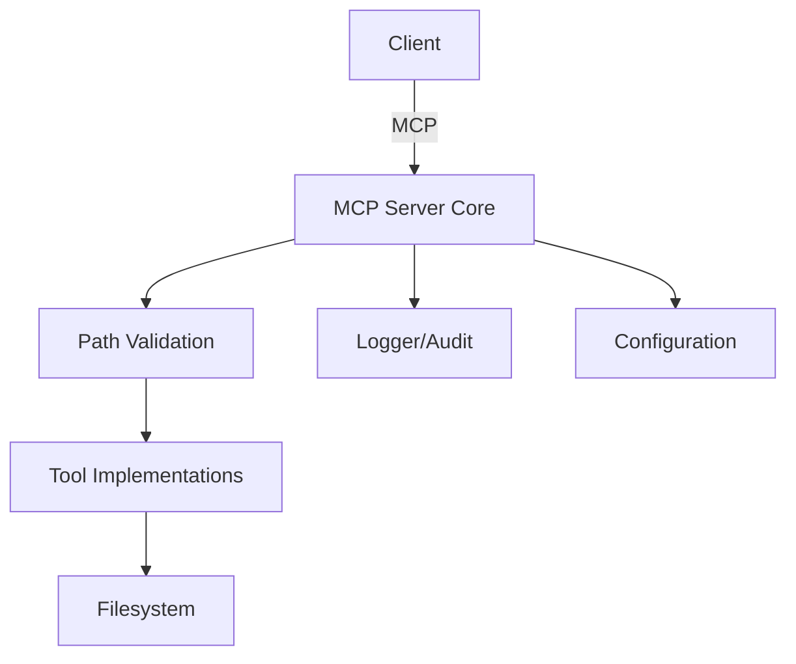

# filers_mcp_architecture_specification

<!--
This document is the architecture specification for the filers_mcp project. Every section below MUST be completed with technical detail, rationale, and completeness matching or exceeding the level of detail found in the exemplar (e.g., grx_product_specification.md). Placeholders or outlines are not sufficient.
-->

## 1. High-Level Architecture Vision and Scope

### 1.1. Vision
The `filers_mcp` project aims to provide a secure, robust, and extensible filesystem server that implements the Model Context Protocol (MCP) for safe, auditable, and high-performance file operations in distributed and embedded environments. The architecture is designed to minimize the trusted computing base, enforce strict access controls, and support integration with a variety of client systems and security policies.

### 1.2. Scope
- Support for file and directory operations (read, write, list, create, move, delete) over MCP.
- Enforcement of access restrictions to a configurable set of allowed directories.
- Asynchronous, non-blocking I/O using Rust's async ecosystem (tokio).
- Extensible tool interface for future protocol and feature expansion.
- Designed for deployment in both cloud and edge/embedded environments.

### 1.3. Guiding Principles
- **Security by Design:** All file operations are subject to strict path validation and access control.
- **Minimal Privilege:** The server only accesses explicitly allowed directories.
- **Auditability:** All access attempts and errors are logged for traceability.
- **Extensibility:** Modular design allows for new tools and protocol extensions.
- **Performance:** Non-blocking, concurrent I/O for high throughput and low latency.

---

## 2. Architectural Foundations and Constraints

### 2.1. Core Philosophies
- **Zero Trust for Input:** All client input is validated and sanitized.
- **Canonicalization:** All paths are canonicalized before use to prevent traversal and symlink attacks.
- **Protocol Compliance:** Strict adherence to MCP protocol for interoperability.

### 2.2. Constraints
- No file operation may occur outside the allowed directories, even via symlinks.
- All configuration (allowed directories, TLS, etc.) must be explicit; no insecure defaults.
- The server must be deployable on resource-constrained systems (low memory/CPU footprint).

### 2.3. Prior Art and References
- Inspired by seL4 and Redox OS for minimal TCB and robust isolation.
- Protocol and tool design informed by MCP reference servers and best practices from secure filesystems.

---

## 3. Component Architecture

### 3.1. Component Diagram


### 3.2. Example Tool API (Rust)
```rust
/// Read a file with optional head/tail line limits
async fn read_file(path: String, head: Option<usize>, tail: Option<usize>) -> Result<String, Error>;

/// Write content to a file
async fn write_file(path: String, content: String) -> Result<(), Error>;

/// List directory contents
async fn list_directory(path: String) -> Result<Vec<DirEntry>, Error>;
```

### 3.3. Example MCP Request/Response
```json
// Example MCP request to read a file
{
  "tool": "read_file",
  "args": { "path": "/srv/data/example.txt", "head": 10 }
}

// Example MCP response
{
  "result": "First 10 lines of file..."
}
```

---

## 4. Security and Safety Considerations

### 4.1. Security Metrics
- **Access Control Coverage:** 100% of file operations must pass through path validation.
- **Symlink/Traversal Protection:** All symlink and traversal attempts are detected and denied.
- **TLS Support:** All network communication can be secured with TLS.

### 4.2. Safety Notes
- **Fault Isolation:** Errors in one tool or request do not affect others.
- **Input Validation:** All user input is strictly validated to prevent injection and DoS.

### 4.3. Architectural Constraints
- No global mutable state; all state is scoped to requests or validated configuration.
- All error paths are logged and surfaced to the client in protocol-compliant form.

---

## 5. Functional Requirements

### 5.1. File Operations
- Read, write, create, move, and delete files within allowed directories.
- List directory contents, including metadata and size.
- Support for reading file head/tail and partial content.

### 5.2. Directory Operations
- Create, move, and delete directories within allowed roots.
- List directory trees and search for files by pattern.

### 5.3. Security and Validation
- All operations require path validation and access control.
- All errors and denied accesses are logged.

### 5.4. Protocol and Extensibility
- Register new tools with the MCP server without core changes.
- Support for protocol version negotiation and extension.

---

## 6. Non-Functional Requirements

### 6.1. Performance
- Non-blocking, async I/O for all file operations.
- Low memory and CPU usage suitable for embedded deployment.

### 6.2. Reliability
- Graceful error handling and recovery for all operations.
- Comprehensive test coverage for all code paths.

### 6.3. Certifiability and Audit
- All access and error events are logged for audit.
- Code and configuration are structured for review and certification.

---

## 7. Appendices

### 7.1. References
- MCP protocol documentation
- seL4 and Redox OS security models
- Rust async and filesystem best practices

### 7.2. Glossary
- **MCP:** Model Context Protocol
- **TCB:** Trusted Computing Base
- **TLS:** Transport Layer Security

### 7.3. Example Configuration
```toml
allowed_directories = ["/srv/data", "/var/log/filers"]
port = 8080
tls_cert = "/etc/ssl/certs/server.crt"
tls_key = "/etc/ssl/private/server.key"
```

### 7.4. Example Error Handling
```json
// Example error response for denied access
{
  "error": "AccessDenied",
  "message": "Path '/etc/passwd' is not within allowed directories."
}
```

### 7.5. Example Directory Listing Output
```json
[
  { "name": "file1.txt", "size": 1024, "modified": "2025-07-01T12:00:00Z" },
  { "name": "subdir", "type": "directory" }
]
```
